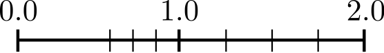

## Lecture 3: String Formatting, other Container Types and Floating Point Numbers

### Center for Mathematical Sciences, Lund University
Lecturer: Malin Christersson, `Robert Klöfkorn`

## This lecture

- Training exercises
- String formatting
- Dictionaries
- Sets
- Tuples
- Container conversions
- Floating point numbers

## Basic string formatting
Book p. 43

- Using keywords:

```{pyodide-python}
str1 = "I'm a {somethingelse}.".format(somethingelse = "string")
str2 = "I'm a {something}.".format(something = 10)
something = 10
str3 = f"I'm a {something}."
print(str2)
print(str3)
```

- Using positional arguments:

```{pyodide-python}
print("Two strings, {} and {}.".format("a", "b"))
```

## f-strings

An elegant alternative in modern Python is the use of `f-strings`.

```{pyodide-python}
quantity = 33.45
other_quantity = 2
text = f"""
We use {quantity} g sugar and {other_quantity} g salt.
In total {quantity + other_quantity} g."""
print(text)
```

To enable this interpretation of the text enclosed in `{...}` the string has to prefixed by the letter `f`.

## Old string formatting

- for strings

```{pyodide-python}
course_code = "NUMA01"
print("This course’s code is %s" % course_code)
```

- for integers

```{pyodide-python}
nb_students = 16
print("There are %i students" % nb_students)
```

 - for floats

```{pyodide-python}
average_grade = 3.4
print("Average grade: %f" % average_grade)
```

See for example [**C** function printf](https://en.cppreference.com/w/c/io/fprintf) for explanation of formatting characters.


## Formatting numbers using f-strings

We can right-align numbers at some position which is written after a colon.

```{pyodide-python}
print("number      square")
print("------------------")
for i in range(-2, 3):
    print(f"{i:6} {i*i:10}")
    #print(f"{i} {i*i}")
```

## Alignment and decimals

We can add `.2f`to show two decimals:

```{pyodide-python}
from numpy import arange
print("number      square")
print("------------------")
for i in arange(0.2, 0.5, 0.1):
    print(f"{i:6.2f} {i*i:10.2f}")
```

## Decimals and scientific notation

More examples

```{pyodide-python}
quantity = 33.45
print(f"five decimals: {quantity:0.5f}")
print(f"scientific notation with two decimals: {quantity:0.2e}")
```

## Dictionaries

A dictionary is an unordered structure of `key:value` pairs. It is similar to a list but the objects are accessed by `keys` instead of index.

One indicates dictionaries by curly brackets:

```{pyodide-python}
homework = {'Alice': True, 'Bob': False}
homework['Alice']
```

```{pyodide-python}
homework['Bob'] = True
homework['Bob']
```

## Adding and deleting

```{pyodide-python}
homework = {'Alice': True, 'Bob': False, 'Alice': False}
homework['Caesar'] = True
print(homework)

del homework['Bob']
print(homework)
```

Note: The keys must be **unique**.

## Datatypes of keys

Any **immutable** (unchangable) object can be used as a key, e.g. strings, numbers, Booleans, etc are fine, but **not list**s.

```{pyodide-python}
my_dict = {1: "alpha", 2: "beta", 3: "gamma", "lang": "Greek", 5: [1,2,3]}
print(my_dict[1])
print(my_dict[5])
print(my_dict["lang"])
aa = 10 
my_dict[ aa ] = True 
print(my_dict)
```

## Looping through dictionaries

A dictionary is an object with the following useful methods: `keys`, `items`, `values`.

By default a dictionary is considered as a list of keys:

```{pyodide-python}
for key in homework:  # or homework.keys()
    print(f"The key {key} has the value {homework[key]}.")
```

```{pyodide-python}
for key, value in homework.items():  # using the items method
    print(f"{key}: {value}")
```

```{pyodide-python}
for value in homework.values():  # using the value method
    print(value)
```

## Dictionaries in this course

Dictionaries are mainly used for

- providing functions with argument in a compact way (Lecture 4)
- to collect options of a method:

`{'tol':1.e-3, 'step':0.1, 'maxit':1000}`

## Sets

Sets are containers which mimic sets in their mathematical sense:

### Definition:
A set is a collection of well defined and distinct objects, considered as an object in its own right. (Wikipedia)

```{pyodide-python}
fruits = set(['apple', 'pear', 'banana', 'banana'])
print(fruits)
```

The most important operation is `in`, meaning $\in$ (is element of):

```{pyodide-python}
'plum' in fruits
```

```{pyodide-python}
'pear' in fruits
```

## Operations on Sets

- $A \cap B$ &hyphen; method `intersection`
- $A \cup B$ &hyphen; method `union`
- $A/B$, relative complement &hyphen; subtract operation

```{pyodide-python}
fruitbasket = set(['apple', 'pear', 'banana', 'banana'])
print(fruitbasket)
rotten = set(['pear', 'orange'])
exotic = set(['banana', 'mango', 'kiwi'])
emptyset = set([])

print(emptyset == fruitbasket.intersection(rotten)) # are all edible

extendedbasket = fruitbasket.union(exotic)
goodfruits = fruitbasket - rotten

print("extendedbasket =", extendedbasket)
print("goodfruits =", goodfruits)
```

## No duplicate elements

"...distinct objects..." (see mathematical definition)

This is reflected in Python by

```{pyodide-python}
s = {'apple', 'apple', 'pear'}
print(s)
set(['apple', 'apple', 'pear']) == set(['apple', 'pear'])
```

## Tuples

### Definition
A **tuple** is an **immutable** list. Immutable means that it cannot be modified.

### Example

```{pyodide-python}
my_tuple = (1, 2, 3) # our first tuple
my_tuple = 1, 2, 3   # parentheses not required
print("The length of my_tuple is", len(my_tuple))  # same as for lists

# my_tuple[0] = 'a'    # error! tuples are immutable
my_tuple = ('a', 2, 3)

singleton = 1,    # note the comma
singleton = (1,)  # preferred for readability
print(singleton[0])
print(type(singleton))
```

## Packing and unpacking

One may assign several variables at once by **unpacking** a list or a tuple:

```python

a, b = 0, 1     # a gets value 0 and b gets value 1
a, b = [0, 1]   # exactly the same
(a, b) = 0, 1   # same
[a, b] = [0, 1] # same
```

### The swapping trick!

```python

a, b = b, a
```

## A final word on tuples

- Tuples are nothing else than immutable lists
- In most cases lists may be used instead of tuples
- The parentheses free notation is nice but **dangerous**, you should **use parenthesis when you're not sure**:

```python

a, b = b, a    # the swap trick, equivalent to
(a, b) = (b, a)
# but:
```

```{pyodide-python}
t1 = a, b = [0, 1]
print(type(t1))

value1 = 1, 2 == 3, 4       # a tuple
value2 = (1, 2) == (3, 4)   # a bool
print("value1 =", value1)
print("value2 =", value2)
```

## Container conversions

|From | To | Command |
|:---|:---|:---|
| List | Tuple | `tuple([1, 2, 3])`|
| Tuple | List | `list((1, 2, 3))` |
| List, Tuple | Set | `set([1,2,3]), set((1,2,3))`|
| Set |List| `list({1, 2, 3})`|
| Dictionary | List | `{'a':4}.values()`|
| List | Dictionary | -|

## Summary and overview

| Type | Access | Order | Duplicate values | Mutability |
|:---:|:---:|:---:|:---:|:---:|
| List | index | yes | yes | yes |
| Tuple | index | yes | yes | no |
| Dictionary | key | no | yes | yes |
| Set | no | no | no | yes |

# What are Floating Point Numbers?

# Floating point numbers -- The number e 

The number $e$ can be defined as 

$$e = e^1 = \exp(1) = \lim_{n\to\infty} \Big ( 1 + \frac{1}{n} \Big )^n.$$

```{pyodide-python}
from numpy import *

e = exp(1)
print(f"{e:2.16f}")

n = 100000000
e = (1 + 1/n)**n
print(f"{e:2.16f}")
```

```{pyodide-python}
n = 100000000000000000
e = (1 + 1/n)**n
print(f"{e:2.16f}")
```

## How to create a Floating Point Number?

- By typing it:

```{pyodide-python}
a = 3.012
b = 30.12e-1
c = 0.3012e+1
d = 3e-1
print(a)
print(b)
print(c)
print(d)
```

- As a result from a computation

```{pyodide-python}
n = 2       # This is an integer
a = n/n     # This is a float
m = int(n/n)
print(n)
print(a)
print(m)
```

## Comparing floating point numbers

Operations on floating point numbers rarely return the exact result:

```{pyodide-python}
a = 0.4 - 0.3
print(f"{a:2.18f}")
```

This fact matters when **comparing** floating point numbers:

```{pyodide-python}
(0.4 - 0.3) == 0.1
```

Never compare floats using `==`. Ask instead if they are `near`:

```{pyodide-python}
abs((0.4 - 0.3) - 0.1) < 1e-13
```

```{pyodide-python}
from numpy import exp, inf, nan # not a number
#print(exp(1000.))
a = inf
print(3 - a)
print(3 + a)
print(a + a)
print(a - a)
print(a / a)
```

# Example for internal representation (simplified)

Roughly speaking, a floating-point number is represented by a fixed number of significant digits (the significand) and scaled using an exponent in some fixed base. 

The base for the scaling is normally $2$, $10$ or $16$. 

A number that can be represented exactly is of the following form:

$$ \mbox{significand} \times \mbox{base}^{\mbox{exponent}},$$ where `significand`, `base` and `exponent` are integers (which have a simple representation).

**Note:** The significand is also called `mantissa`.

Example: 

$$1.2345 = \underbrace{12345}_{\mbox{significand}} \times \underbrace{10\phantom{x}}_{\mbox{base}}^{\overbrace{\phantom{x}-4}^{\phantom{xxxxxxxxxx}\mbox{exponent}}}$$

## Internal representation

Floats are represented by three quantities:
The *sign*, the *significand* (or *mantissa*) and the *exponent*:
$$
\text{sign}(x) \left( x_0 + x_1 \beta^{-1} + \dots + x_{t-1} \beta^{-(t-1)} \right) \beta^k, \quad \beta \in \mathbb{N}, \quad x_0 \neq 0, \quad 0 \leq x_i < \beta.
$$

- $x_0, \dots, x_{t-1}$ is the significand,
- $t$ is the length of the significand,
- $\beta$ is the basis,
- $k$ is the exponent with $|k| \leq k_{max}$.

Normalization $x_0 \neq 0$ makes the representation unique (and saves one bit in the case $\beta = 2$ and allows to add $x_t \beta^{-t}$).

On your computer for a normal float (double):
- $\beta = 2$, 
- $t = 52$, 
- $k_{max} = 1023$ (which needs 10 bits). 

Together with the sign and the full range (sign) of the exponent, this requires 64 bits.

## Internal representation (cont.)

We then have the following representation (adding $x_t \beta^{-t}$ because $x_0$ is fixed):
$$
(-1)^{\text{sign}} \left( \underbrace{1}_{= x_0} + \sum_{i=1}^{t} x_i 2^{-i}\right) 2^k, \quad x_i \in \{0,1\}.
$$

$0$ cannot be represented as a *normalized* float.

**Two zeroes:** All the exponent bits $0$ with all significand bits $0$ represents $0$. 
If sign bit is $0$, then we have $0$, else $-0$.

**Infinity:** All the exponent bits $1$ with all significand bits $0$ represents infinity.

**Denormalized number:** All the exponent bits $0$ and significand bits non-zero represents denormalized number.

**Error:** All the exponent bits $1$ and significand bits non-zero represents error or `nan` (Not a Number).

## Precision -- Machine epsilon

### Definition (Maching epsilon):

The *machine epsilon* or rounding unit is the gap between $1.0$ and the next larger floating point number, i.e. the largest number $\epsilon$ such that
$$
\mathrm{float}(1.0 + \epsilon) = 1.0
$$

**Challenge**: Write a program which finds this number (or a good estimate for it).

See also

```{pyodide-python}
import sys
sys.float_info.epsilon
```

## What precision do I have at what number 

What decimal precision do I have at a given number $a \in \mathbb{R}$?

To figure out the precision we have at a number, we find the interval such that $a \in [2^k, 2^{k+1})$.
We then subdivide that range using the `significand` bits.

Example: $3.5 \in [2,4)$. A float in Python has 52 bits of `significand`, so the precision we have at 3.5 is:

$$(4-2) 2^{-52} = \frac{2}{4503599627370496} \approx 0.00000000000000044408921$$

$3.5$ itself is actually exactly representable by a float, but the amount of precision numbers we have at that scale is that value. The smallest number you can add or subtract to a value between $2$ and $4$ is that value. That is the resolution of the values you are working with when working between $2$ and $4$ using a float.

```{pyodide-python}
prec = (4-2) * 2**-52
print(f"prec for 3.5 is {prec}")
```

1. What decimal precision do I have at $13689.0$?
2. What is the largest possible floating point number in this double precision representation? 
3. What is the smallest gap between floating point numbers around zero? 

**5min, let's go!**

```{pyodide-python}

```

```{pyodide-python}
prec = (2**14 - 2**13)* 2**-52
print(f"prec for 13689 is {prec}")

largest = 2**1023
print(f"Largest floating point number: {largest:2.4e}")

smallest = 2**-1023
print(f"Distance between 0 and next number: {smallest:2.4e}")
```

## Internal representation (cont.)

The smallest positive representable number is
$$
\mathrm{fl_{min}} = 1 \cdot 2^{-1023} \approx 10^{-308}
$$
and the largest is
$$
\mathrm{fl_{max}} = 1.111 \dots 1 \cdot 2^{1023} \approx 10^{308}.
$$

Floating point numbers are not equally spaced in $[0, \mathrm{fl_{max}}]$.

Gap at zero (caused by normalization $x_0 \neq 0$):

Distance between $0$ and the first positive number is $2^{-1023}$.

Distance between the first and the second is smaller by a factor $2^{-52}$.



## Infinite and Not a Number

There are in total $2(\beta-1)\beta^{t-1}(2k_{max} + 1) + 1$ floating point numbers, in short floating point numbers are limited.

Numbers bigger than the maximal floating point number $\mathrm{fl_{max}}$ generate in numpy an `inf` or an overflow exception.

Numbers smaller than the minimal floating point number $\mathrm{fl_{min}}$ generate subnormalized numbers or `not a number`, short `nan`. This leads to unexpected behavior.

```{pyodide-python}
x = nan
print(x < 0)
print(x > 0)
print(x == x)
```

The float `inf` behaves much more as expected:

```{pyodide-python}
print(0 < inf)
print(inf <= inf)
print(inf == inf)
print(-inf < inf)
print(inf - inf)
print(exp(-inf))
print(exp(1/inf))
```

<nav class="bottom-page-nav" aria-label="Page navigation">
  <a class="page-nav-link prev" href="lecture02_summer.html">Previous: Lecture 2</a>
  <a class="page-nav-link next" href="lecture04.html">Next: Lecture 4</a>
</nav>
